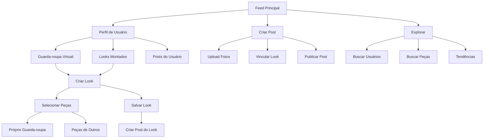

## 1. Product Overview
Rede social focada em moda e roupas que permite aos usuários compartilhar looks, organizar guarda-roupas virtuais e criar looks colaborativos. O app conecta pessoas interessadas em moda, facilitando a criação de novos estilos e o compartilhamento de tendências.

O produto resolve o problema de como organizar e compartilhar peças de roupa digitalmente, permitindo que usuários criem looks usando tanto seu próprio guarda-roupa quanto peças de outros usuários, promovendo colaboração e criatividade na moda.

## 2. Core Features

### 2.1 User Roles
| Role | Registration Method | Core Permissions |
|------|---------------------|------------------|
| Usuário Comum | Email ou redes sociais | Criar posts, montar looks, seguir usuários, interagir com conteúdo |
| Usuário Privado | Configuração de privacidade | Controle sobre visibilidade do guarda-roupa e posts |

### 2.2 Feature Module
Nossa rede social de moda consiste nos seguintes principais elementos:
1. **Feed Principal**: Interface estilo Pinterest com posts de looks e roupas
2. **Perfil de Usuário**: Dividido em Posts / Guarda-roupa / Looks montados
3. **Criador de Looks**: Ferramenta para combinar peças e criar looks completos
4. **Guarda-roupa Virtual**: Organização e gestão de peças de roupa
5. **Explorar**: Busca e descoberta de conteúdo e usuários

### 2.3 Page Details
| Page Name | Module Name | Feature description |
|-----------|-------------|---------------------|
| Feed Principal | Grid de Posts | Exibir posts em layout estilo Pinterest com fotos de looks e roupas, scroll infinito e lazy loading. |
| Feed Principal | Barra de Navegação | Acesso rápido para explorar, criar post, notificações e perfil. |
| Feed Principal | Filtros e Busca | Filtrar por categoria, cor, estilo, marca e busca por hashtags. |
| Perfil de Usuário | Seção Posts | Exibir todos os posts do usuário em grid visual. |
| Perfil de Usuário | Seção Guarda-roupa | Mostrar peças de roupa organizadas por categorias. |
| Perfil de Usuário | Seção Looks | Exibir looks montados pelo usuário, incluindo colaborativos. |
| Perfil de Usuário | Info do Perfil | Foto, bio, contador de seguidores/seguindo, botão de seguir. |
| Criador de Looks | Canvas de Montagem | Arrastar e soltar peças para criar composições visuais. |
| Criador de Looks | Seleção de Peças | Escolher entre próprio guarda-roupa ou peças públicas de outros usuários. |
| Criador de Looks | Informações do Look | Adicionar nome, descrição, tags e definir visibilidade. |
| Guarda-roupa Virtual | Lista de Peças | Visualizar todas as peças com miniaturas e informações básicas. |
| Guarda-roupa Virtual | Adicionar Peça | Upload de fotos, categorização e adição de metadados. |
| Guarda-roupa Virtual | Organização | Criar categorias personalizadas e gerenciar visibilidade. |
| Explorar | Busca Visual | Busca por imagem similar e descoberta de conteúdo. |
| Explorar | Usuários Sugeridos | Recomendações de perfis para seguir baseado em interesses. |
| Explorar | Tendências | Looks e peças mais populares da comunidade. |
| Notificações | Centro de Notificações | Visualizar curtidas, comentários, novos seguidores e menções. |
| Criar Post | Upload de Fotos | Selecionar até 10 fotos com processamento automático. |
| Criar Post | Vincular Look | Conectar o post a um look criado ou criar novo look. |
| Criar Post | Legenda e Tags | Adicionar descrição, hashtags e mencionar outros usuários. |

## 3. Core Process
### Fluxo Principal do Usuário
1. **Descoberta**: Usuário entra no feed principal e explora conteúdo através do algoritmo de recomendação estilo Pinterest
2. **Interação**: Usuário curte, comenta, salva posts e segue outros usuários
3. **Criação**: Usuário pode criar posts com fotos de looks ou adicionar peças ao guarda-roupa virtual
4. **Colaboração**: Usuário cria looks usando próprias peças ou peças públicas de outros usuários
5. **Compartilhamento**: Looks criados podem ser compartilhados como posts no feed

### Fluxo de Criação de Look Colaborativo
1. Usuário acessa o criador de looks
2. Seleciona peças do próprio guarda-roupa
3. Busca e adiciona peças públicas de outros usuários
4. Sistema atribui créditos automáticos aos donos das peças
5. Usuário salva o look e opcionalmente cria um post
6. Donos das peças recebem notificação sobre uso colaborativo

## 4. User Interface Design

### 4.1 Design Style
- **Cores Primárias**: Branco (#FFFFFF) e preto (#000000) para base clean
- **Cores Secundárias**: Rosa suave (#FFB6C1) e cinza claro (#F5F5F5) para toque feminino
- **Botões**: Estilo arredondado com sombras suaves, hover effects sutis
- **Fontes**: Sans-serif moderna (Inter ou Roboto), títulos em negrito, corpo regular
- **Ícones**: Estilo outline minimalista, consistente com design de moda
- **Layout**: Card-based com espaçamento generoso, grid responsivo tipo Pinterest

### 4.2 Page Design Overview
| Page Name | Module Name | UI Elements |
|-----------|-------------|-------------|
| Feed Principal | Grid de Posts | Cards com bordas arredondadas, imagens com aspect-ratio 4:5, overlay com info ao hover, fonte pequena para metadados |
| Perfil de Usuário | Header | Foto circular grande, bio centralizada, stats em cards horizontais, botão seguir destacado |
| Criador de Looks | Canvas | Área de trabalho com fundo neutro, peças como cards arrastáveis, snap-to-grid, preview em tempo real |
| Guarda-roupa Virtual | Grid de Peças | Miniaturas quadradas com categorias coloridas, modal ao clicar para detalhes, drag-and-drop para reorganizar |
| Notificações | Lista | Cards com avatar do usuário, texto preview, timestamp relativo, indicador visual para não lidas |

### 4.3 Responsiveness
- **Desktop-first**: Otimizado para telas grandes com layout Pinterest de múltiplas colunas
- **Mobile-adaptive**: Single column no mobile com bottom navigation bar
- **Touch optimization**: Gestos de swipe para navegação, botões grandes para touch targets
- **Breakpoints**: Desktop (1200px+), Tablet (768px-1199px), Mobile (<768px)

### 4.4 Features Especiais de UI/UX
- **Infinite Scroll**: Carregamento automático de novos posts ao scrollar
- **Lazy Loading**: Imagens carregam sob demanda para performance
- **Visual Search**: Upload de imagem para encontrar peças/looks similares
- **Drag & Drop**: Interface intuitiva para criar looks no canvas
- **Real-time Updates**: Curtidas e comentários aparecem instantaneamente
- **Gesture Support**: Swipe para navegar entre seções no mobile