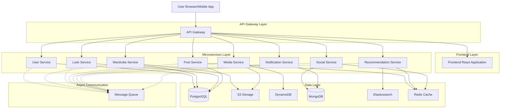
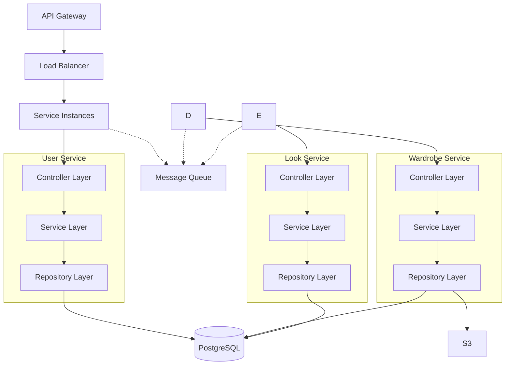
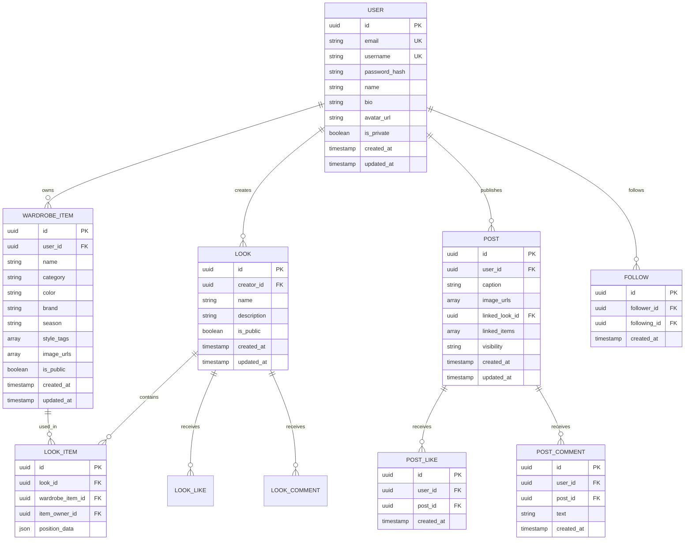

## 1. Architecture design



## 2. Technology Description

- **Frontend**: React@18 + TypeScript + TailwindCSS@3 + Vite
- **Initialization Tool**: vite-init
- **API Gateway**: Kong/AWS API Gateway
- **Backend**: Node.js@18 + Express/NestJS (microsserviços)
- **Databases**: 
  - PostgreSQL (neon.tech) - User, Wardrobe, Look, Post Services
  - MongoDB - Social, Notification Services
  - Redis - Cache e sessões
  - Elasticsearch - Busca e recomendações
  - DynamoDB - Metadados de mídia
- **Storage**: AWS S3 para imagens
- **Message Queue**: RabbitMQ para comunicação assíncrona
- **Container**: Docker + Kubernetes

## 3. Route definitions

| Route | Purpose | Service |
|-------|---------|---------|
| /api/auth/* | Autenticação e autorização | User Service |
| /api/users/* | Gerenciamento de usuários | User Service |
| /api/wardrobe/* | CRUD de peças do guarda-roupa | Wardrobe Service |
| /api/looks/* | Criação e gestão de looks | Look Service |
| /api/posts/* | Posts e feed | Post Service |
| /api/feed | Feed personalizado | Post Service |
| /api/interactions/* | Curtidas, comentários, salvos | Social Service |
| /api/media/* | Upload e processamento de imagens | Media Service |
| /api/recommendations/* | Sistema de recomendações | Recommendation Service |
| /api/notifications/* | Sistema de notificações | Notification Service |

## 4. API definitions

### 4.1 User Service APIs

**Autenticação**
```
POST /api/auth/register
```
Request:
```json
{
  "email": "string",
  "password": "string",
  "name": "string",
  "username": "string"
}
```

```
POST /api/auth/login
```
Request:
```json
{
  "email": "string",
  "password": "string"
}
```
Response:
```json
{
  "access_token": "string",
  "refresh_token": "string",
  "user": {
    "id": "uuid",
    "email": "string",
    "name": "string",
    "username": "string"
  }
}
```

**Gerenciamento de Usuários**
```
GET /api/users/{id}
PUT /api/users/{id}
POST /api/users/{id}/follow
DELETE /api/users/{id}/unfollow
GET /api/users/{id}/followers
GET /api/users/{id}/following
```

### 4.2 Wardrobe Service APIs

```
POST /api/wardrobe/items
GET /api/wardrobe/{userId}
GET /api/wardrobe/items/{id}
PUT /api/wardrobe/items/{id}
DELETE /api/wardrobe/items/{id}
PUT /api/wardrobe/items/{id}/permissions
```

Request Body (criar item):
```json
{
  "name": "string",
  "category": "string",
  "color": "string",
  "brand": "string",
  "season": "string",
  "style_tags": ["string"],
  "image_urls": ["string"],
  "is_public": "boolean"
}
```

### 4.3 Look Service APIs

```
POST /api/looks
GET /api/looks/{id}
PUT /api/looks/{id}
DELETE /api/looks/{id}
GET /api/users/{id}/looks
POST /api/looks/{id}/favorite
```

Request Body (criar look):
```json
{
  "name": "string",
  "description": "string",
  "item_ids": ["uuid"],
  "is_public": "boolean"
}
```

### 4.4 Post Service APIs

```
POST /api/posts
GET /api/posts/{id}
GET /api/feed
GET /api/users/{id}/posts
GET /api/posts/search
```

Request Body (criar post):
```json
{
  "caption": "string",
  "image_urls": ["string"],
  "linked_look_id": "uuid",
  "linked_items": ["uuid"],
  "visibility": "string"
}
```

### 4.5 Social Service APIs

```
POST /api/posts/{id}/like
DELETE /api/posts/{id}/like
POST /api/posts/{id}/comment
GET /api/posts/{id}/comments
POST /api/posts/{id}/save
```

## 5. Server architecture diagram



## 6. Data model

### 6.1 Data model definition



### 6.2 Data Definition Language

**User Table (users)**
```sql
-- create table
CREATE TABLE users (
    id UUID PRIMARY KEY DEFAULT gen_random_uuid(),
    email VARCHAR(255) UNIQUE NOT NULL,
    username VARCHAR(50) UNIQUE NOT NULL,
    password_hash VARCHAR(255) NOT NULL,
    name VARCHAR(100) NOT NULL,
    bio TEXT,
    avatar_url VARCHAR(500),
    is_private BOOLEAN DEFAULT false,
    created_at TIMESTAMP WITH TIME ZONE DEFAULT NOW(),
    updated_at TIMESTAMP WITH TIME ZONE DEFAULT NOW()
);

-- create indexes
CREATE INDEX idx_users_email ON users(email);
CREATE INDEX idx_users_username ON users(username);
```

**Wardrobe Items Table (wardrobe_items)**
```sql
-- create table
CREATE TABLE wardrobe_items (
    id UUID PRIMARY KEY DEFAULT gen_random_uuid(),
    user_id UUID NOT NULL REFERENCES users(id) ON DELETE CASCADE,
    name VARCHAR(255) NOT NULL,
    category VARCHAR(50) NOT NULL,
    color VARCHAR(50),
    brand VARCHAR(100),
    season VARCHAR(50),
    style_tags TEXT[],
    image_urls TEXT[],
    is_public BOOLEAN DEFAULT true,
    created_at TIMESTAMP WITH TIME ZONE DEFAULT NOW(),
    updated_at TIMESTAMP WITH TIME ZONE DEFAULT NOW()
);

-- create indexes
CREATE INDEX idx_wardrobe_items_user_id ON wardrobe_items(user_id);
CREATE INDEX idx_wardrobe_items_category ON wardrobe_items(category);
CREATE INDEX idx_wardrobe_items_color ON wardrobe_items(color);
```

**Looks Table (looks)**
```sql
-- create table
CREATE TABLE looks (
    id UUID PRIMARY KEY DEFAULT gen_random_uuid(),
    creator_id UUID NOT NULL REFERENCES users(id) ON DELETE CASCADE,
    name VARCHAR(255) NOT NULL,
    description TEXT,
    is_public BOOLEAN DEFAULT true,
    created_at TIMESTAMP WITH TIME ZONE DEFAULT NOW(),
    updated_at TIMESTAMP WITH TIME ZONE DEFAULT NOW()
);

-- create indexes
CREATE INDEX idx_looks_creator_id ON looks(creator_id);
CREATE INDEX idx_looks_created_at ON looks(created_at DESC);
```

**Look Items Table (look_items)**
```sql
-- create table
CREATE TABLE look_items (
    id UUID PRIMARY KEY DEFAULT gen_random_uuid(),
    look_id UUID NOT NULL REFERENCES looks(id) ON DELETE CASCADE,
    wardrobe_item_id UUID NOT NULL REFERENCES wardrobe_items(id) ON DELETE CASCADE,
    item_owner_id UUID NOT NULL REFERENCES users(id) ON DELETE CASCADE,
    position_data JSONB,
    created_at TIMESTAMP WITH TIME ZONE DEFAULT NOW()
);

-- create indexes
CREATE INDEX idx_look_items_look_id ON look_items(look_id);
CREATE INDEX idx_look_items_wardrobe_item_id ON look_items(wardrobe_item_id);
```

**Posts Table (posts)**
```sql
-- create table
CREATE TABLE posts (
    id UUID PRIMARY KEY DEFAULT gen_random_uuid(),
    user_id UUID NOT NULL REFERENCES users(id) ON DELETE CASCADE,
    caption TEXT,
    image_urls TEXT[],
    linked_look_id UUID REFERENCES looks(id),
    linked_items UUID[],
    visibility VARCHAR(20) DEFAULT 'public' CHECK (visibility IN ('public', 'followers', 'private')),
    created_at TIMESTAMP WITH TIME ZONE DEFAULT NOW(),
    updated_at TIMESTAMP WITH TIME ZONE DEFAULT NOW()
);

-- create indexes
CREATE INDEX idx_posts_user_id ON posts(user_id);
CREATE INDEX idx_posts_created_at ON posts(created_at DESC);
CREATE INDEX idx_posts_visibility ON posts(visibility);
```

## 7. Security Considerations

### 7.1 Authentication & Authorization
- JWT tokens com assinatura HMAC256 e expiração de 15 minutos
- Refresh tokens com expiração de 7 dias e rotação automática
- OAuth2 integration com Google, Apple, Facebook
- Rate limiting: 100 requests/min por usuário, 5 tentativas de login

### 7.2 Data Protection
- HTTPS obrigatório em todas as comunicações
- Bcrypt para hash de senhas (cost factor 12)
- Sanitização de inputs para prevenir SQL injection
- XSS prevention com output encoding
- CORS configurado com whitelist de domínios

### 7.3 Privacy & Compliance
- Configurações de privacidade granulares por usuário
- GDPR compliance com direito ao esquecimento
- Export de dados do usuário em formato JSON
- Consent management para notificações e cookies

### 7.4 Content Moderation
- Sistema de report para conteúdo inapropriado
- Filtro automático de conteúdo com ML
- Moderador dashboard para revisão manual
- Shadow banning para usuários problemáticos

## 8. Performance & Scalability

### 8.1 Caching Strategy
- Redis para cache de feeds (TTL: 5 minutos)
- Cache de perfis de usuário (TTL: 15 minutos)
- Cache de contadores (likes, comments) com invalidação automática
- CDN para imagens com cache de 1 ano

### 8.2 Database Optimization
- Read replicas para queries pesadas
- Connection pooling com PgBouncer
- Índices em todas as queries frequentes
- Partitioning para tabelas grandes (posts, interactions)

### 8.3 Async Processing
- Image processing em background workers
- Recommendation updates em batch jobs noturnos
- Email sending via queues com retry logic
- Event aggregation para notificações

### 8.4 Auto-scaling
- Kubernetes HPA baseado em CPU (>70%) e memory
- Min 2 pods, max 10 pods por serviço
- Horizontal scaling para serviços stateless
- Vertical scaling para bancos de dados quando necessário